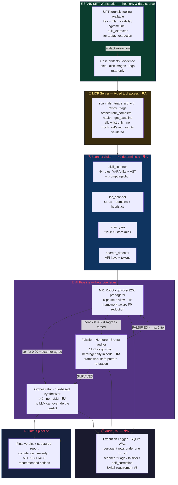

# Architecture Diagram — MR. Robot Adversarial

## System Architecture

**Architectural pattern (SANS taxonomy):** **Direct Agent Extension + Custom MCP Server (hybrid)**
— the agent extends the SANS SIFT Workstation's analysis loop, and *every* tool is reached only
through a typed, allow-listed MCP server (no free-form shell).

**Guardrail legend (read the diagram with this):**
🛡️**A** = *architectural* guardrail — enforced by code / types / process / filesystem isolation;
**cannot be prompted away.**  📝**P** = *prompt-based* guardrail — soft instruction the model may
ignore. Security rests on the 🛡️A layer; 📝P is for analysis *quality* only. Full catalogue:
[`architectural_guardrails.md`](architectural_guardrails.md) (11 architectural · 3 hybrid · 5 prompt-based).



> **Where security is enforced (🛡️A, at a glance):** input validation + read-only case mounts
> (TB1) · deterministic scanner sandbox, no network (TB2) · heterogeneity check + τ=0 synthesizer
> so no LLM overrides the verdict (TB3) · MCP allow-list, no destructive commands (TB4). The 5-phase
> review prompt is the only 📝P element and is **never** load-bearing for security — see the
> prompt-vs-architectural table below.

## Trust Boundaries

```
┌─────────────────────────────────────────────────────────────────┐
│ TRUST BOUNDARY 1: Input Validation                              │
│ • validate_target_file() rejects paths outside allowed roots    │
│ • Binary files flagged (MAL-008)                                │
│ • File size limit (50KB default)                                │
├─────────────────────────────────────────────────────────────────┤
│ TRUST BOUNDARY 2: Scanner Suite (deterministic, τ=0)           │
│ • No LLM calls — pure regex + AST + YARA                       │
│ • No network access from scanners                               │
│ • Read-only file access                                         │
├─────────────────────────────────────────────────────────────────┤
│ TRUST BOUNDARY 3: AI Pipeline (heterogeneous)                   │
│ • MR. Robot (gpt-oss-120b) — propagator only                   │
│ • Falsifier (Nemotron-3-Ultra) — auditor only, ΔA≈1 enforced   │
│ • Orchestrator (rule-based) — τ=0, no LLM                      │
│ • Max 2 correction iterations (Shehata & Li 2026)               │
├─────────────────────────────────────────────────────────────────┤
│ TRUST BOUNDARY 4: MCP Server (architectural guardrails)         │
│ • Only safe functions exposed (scan, triage, falsify)           │
│ • No destructive commands (rm, chmod, exec)                     │
│ • No network access from MCP tools                              │
│ • All inputs validated before processing                        │
└─────────────────────────────────────────────────────────────────┘
```

## Guardrails — architectural vs prompt-based (at a glance)

The SANS rubric requires these be **clearly distinguished**. Security is carried by the
🛡️**A** (architectural) layer — enforced in code, no LLM authority. 📝**P** (prompt-based) is
*quality only*. Full catalogue with file:line and bypass analysis in
[`architectural_guardrails.md`](architectural_guardrails.md).

| Guardrail | Type | Enforced where (file) | If the LLM ignores it… |
|---|---|---|---|
| Path validation / read-only roots | 🛡️A | `mcp_tools.py` `validate_target_file` | runs *before* any LLM call — no effect |
| File-size cap on LLM ingestion | 🛡️A | `agents/mr_robot/triage.py` `MAX_TRIAGE_FILE_BYTES` | short-circuits to INCONCLUSIVE |
| Subprocess-isolated scanners, no network | 🛡️A | `mcp_tools.py` scanner runners | scanners are τ=0, not LLM-driven |
| MCP allow-list (no rm/chmod/exec) | 🛡️A | `mcp_server.py` tool registry | tool simply doesn't exist to call |
| **τ=0 rule-based synthesizer** | 🛡️A | `triage_orchestrator.py` `_compute_synthesizer_verdict` | **no LLM can override the final verdict** |
| **Heterogeneity / kinship-lock check** | 🛡️A | `triage_orchestrator.py` `_check_heterogeneity` | flagged in audit even if the model is silent |
| Bounded correction (max 2 iters) | 🛡️A | `triage_orchestrator.py` loop bound | loop cannot run away |
| Per-agent audit trail under run_id | 🛡️A | `execution_logger.py` + `audit.log(...)` | logging is outside the model's control |
| Prompt-injection sentinel boundary | 🛡️A+📝 (hybrid) | `prompt_injection_defense.scan_and_wrap` | architectural wrap holds; notice is the soft half |
| Framework-aware FP refutation | 🛡️A+📝 (hybrid) | falsifier review path | scanner/synthesizer still bound the result |
| 5-phase review discipline | 📝P | system prompt in `agents/mr_robot/triage.py` | analysis quality drops; **security unaffected** |

## Data Flow

```
File Input
    │
    ▼
┌──────────────────┐
│ Input Validation │ ← Trust Boundary 1
│ (path, size,     │
│  binary check)   │
└────────┬─────────┘
         │
         ▼
┌──────────────────┐
│ Scanner Suite    │ ← Trust Boundary 2
│ (4 scanners,     │
│  deterministic)  │
└────────┬─────────┘
         │
         ▼
┌──────────────────┐     ┌──────────────────┐
│ MR. Robot        │────→│ Falsifier        │ ← Trust Boundary 3
│ (gpt-oss-120b)   │     │ (Nemotron, ΔA≈1) │
│ 5-phase review   │←────│ max 2 iterations │
└────────┬─────────┘     └──────────────────┘
         │
         ▼
┌──────────────────┐
│ Orchestrator     │ ← Trust Boundary 3
│ (rule-based, τ=0)│
└────────┬─────────┘
         │
         ▼
┌──────────────────┐
│ Final Verdict    │
│ + Audit Trail    │ ← Trust Boundary 4
└──────────────────┘
```

## Heterogeneity Mandate (Shehata & Li 2026)

Per [arXiv:2604.27274](https://arxiv.org/abs/2604.27274), same-family agent
swarms produce kinship lock (τ≈1) → Logic Saturation → 100% error.
Reinforced by prior multi-agent diversity literature (Du 2023, Liang 2023,
Wang 2022) and LLM sycophancy research (Sharma 2023). Full references in
[`docs/heterogeneity_mandate.md`](heterogeneity_mandate.md).

Our enforcement (default configuration):
- **Propagator:** gpt-oss-120b (openai/gpt-oss-120b, the `openrouter` provider)
- **Auditor:** Nemotron-3-Ultra (nvidia/nemotron-3-ultra, the `falsifier` provider)
- **Synthesizer:** Rule-based (τ=0, no model family)
- **ΔA ≈ 1.0** (architecturally different families — gpt-oss vs Nemotron)
- **Max 2 iterations** (paper proves >2 with same family makes error worse)
