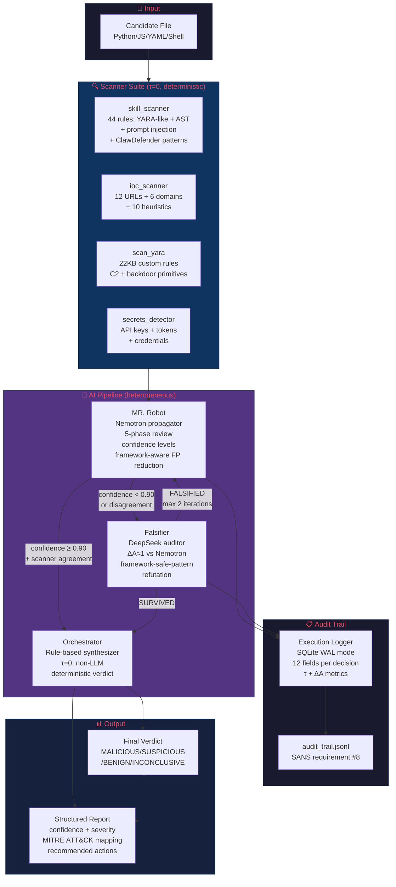

# Architecture Diagram — MR. Robot Adversarial

## System Architecture



## Trust Boundaries

```
┌─────────────────────────────────────────────────────────────────┐
│ TRUST BOUNDARY 1: Input Validation                              │
│ • validate_target_file() rejects paths outside allowed roots    │
│ • Binary files flagged (MAL-008)                                │
│ • File size limit (50KB default)                                │
├─────────────────────────────────────────────────────────────────┤
│ TRUST BOUNDARY 2: Scanner Suite (deterministic, τ=0)           │
│ • No LLM calls — pure regex + AST + YARA                       │
│ • No network access from scanners                               │
│ • Read-only file access                                         │
├─────────────────────────────────────────────────────────────────┤
│ TRUST BOUNDARY 3: AI Pipeline (heterogeneous)                   │
│ • MR. Robot (Nemotron) — propagator only                       │
│ • Falsifier (DeepSeek) — auditor only, ΔA≈1 enforced           │
│ • Orchestrator (rule-based) — τ=0, no LLM                      │
│ • Max 2 correction iterations (Shehata & Li 2026)               │
├─────────────────────────────────────────────────────────────────┤
│ TRUST BOUNDARY 4: MCP Server (architectural guardrails)         │
│ • Only safe functions exposed (scan, triage, falsify)           │
│ • No destructive commands (rm, chmod, exec)                     │
│ • No network access from MCP tools                              │
│ • All inputs validated before processing                        │
└─────────────────────────────────────────────────────────────────┘
```

## Data Flow

```
File Input
    │
    ▼
┌──────────────────┐
│ Input Validation │ ← Trust Boundary 1
│ (path, size,     │
│  binary check)   │
└────────┬─────────┘
         │
         ▼
┌──────────────────┐
│ Scanner Suite    │ ← Trust Boundary 2
│ (4 scanners,     │
│  deterministic)  │
└────────┬─────────┘
         │
         ▼
┌──────────────────┐     ┌──────────────────┐
│ MR. Robot        │────→│ Falsifier        │ ← Trust Boundary 3
│ (Nemotron)       │     │ (DeepSeek, ΔA≈1) │
│ 5-phase review   │←────│ max 2 iterations │
└────────┬─────────┘     └──────────────────┘
         │
         ▼
┌──────────────────┐
│ Orchestrator     │ ← Trust Boundary 3
│ (rule-based, τ=0)│
└────────┬─────────┘
         │
         ▼
┌──────────────────┐
│ Final Verdict    │
│ + Audit Trail    │ ← Trust Boundary 4
└──────────────────┘
```

## Heterogeneity Mandate (Shehata & Li 2026)

Per arXiv:2604.27274, same-family agent swarms produce kinship lock (τ≈1) → Logic Saturation → 100% error.

Our enforcement:
- **Propagator:** NVIDIA Nemotron (mistralai/mistral-nemotron)
- **Auditor:** DeepSeek (deepseek/deepseek-chat-v3-0324)
- **Synthesizer:** Rule-based (τ=0, no model family)
- **ΔA ≈ 1.0** (architecturally different families)
- **Max 2 iterations** (paper proves >2 with same family makes error worse)
